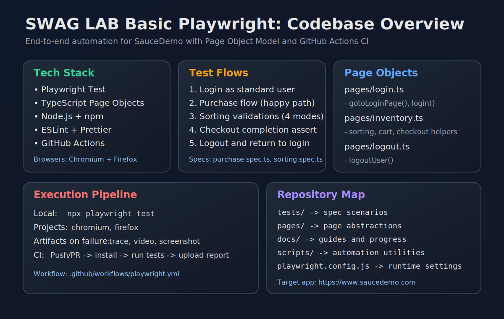

# Swag Labs E2E Test Suite

[](https://playwright.dev/)
[](https://www.typescriptlang.org/)
[](https://nodejs.org/)
[](https://eslint.org/)
[](https://github.com/atiarmridul/SWAG_LAB_Basic_Playwright/actions/workflows/playwright.yml)

This repository contains a Playwright end-to-end test suite for [Sauce Demo](https://www.saucedemo.com/). Current coverage includes a complete happy-path purchase flow and inventory sorting validation.

## Codebase Infographic



## Project Links

- Target app: https://www.saucedemo.com/
- Agent guide: [docs/AGENT.md](./docs/AGENT.md)
- Progress tracker: [docs/AGENT_PROGRESS.md](./docs/AGENT_PROGRESS.md)
- Page object guide: [docs/PAGES.md](./docs/PAGES.md)
- Test guide: [docs/TESTS.md](./docs/TESTS.md)
- Test case catalog: [docs/TEST_CASES.md](./docs/TEST_CASES.md)
- Walkthrough: [docs/WALKTHROUGH.md](./docs/WALKTHROUGH.md)
- Contribution guide: [docs/CONTRIBUTING.md](./docs/CONTRIBUTING.md)

## Tech Stack

- Playwright Test
- TypeScript page objects
- Node.js and npm
- ESLint
- GitHub Actions

## Project Structure

```text
.
├── .github/workflows/
│   └── playwright.yml          # CI workflow for Playwright tests.
├── docs/
│   ├── AGENT.md                # Workspace guide for agents and maintainers.
│   ├── AGENT_PROGRESS.md       # Current status and handoff notes.
│   ├── CONTRIBUTING.md         # Local workflow and code standards.
│   ├── PAGES.md                # Page Object Model documentation.
│   ├── TESTS.md                # Test execution and authoring guide.
│   ├── TEST_CASES.md           # Executed test-case flows and expectations.
│   └── WALKTHROUGH.md          # Current flow and implementation notes.
├── pages/
│   ├── inventory.ts            # Inventory, cart, and checkout page actions.
│   ├── login.ts                # Login page actions.
│   └── logout.ts               # Menu logout actions.
├── scripts/
│   ├── local-mcp-server.js     # Local MCP server utility.
│   └── update-docs.js          # Runs tests and updates AGENT_PROGRESS.md.
├── tests/
│   ├── purchase.spec.ts        # Main SauceDemo purchase flow.
│   └── sorting.spec.ts         # Inventory sorting verification flow.
├── eslint.config.mjs
├── package.json
├── package-lock.json
└── playwright.config.js
```

Generated folders such as `node_modules/`, `test-results/`, and `playwright-report/` are not source files.

## Install

```bash
npm install
npx playwright install
```

## Run Tests

Run all configured browser projects:

```bash
npx playwright test
```

Run only one browser project:

```bash
npx playwright test --project=chromium
npx playwright test --project=firefox
```

Run in headed mode:

```bash
npx playwright test --headed
```

Open the HTML report:

```bash
npx playwright show-report
```

## Configuration

The Playwright configuration is in [playwright.config.js](./playwright.config.js).

Current behavior:

- Tests live in `tests/`.
- Chromium and Firefox projects are enabled.
- WebKit is present as a commented option.
- Tests run headless by default.
- Traces are retained on failure.
- `data-test` is configured as the test id attribute.
- `workers` is set to `4`.
- Retries are `0` locally and `2` on CI.
- Browser binaries must be installed locally with `npx playwright install`.

## Documentation Automation

Run this command to execute the tests and refresh the results block in [docs/AGENT_PROGRESS.md](./docs/AGENT_PROGRESS.md):

```bash
npm run update-docs
```

The script also attempts to sync selected docs to the local agent brain directory when that directory exists on the machine.

## Current Flows

`tests/purchase.spec.ts` uses `test.beforeEach` to log in with SauceDemo standard credentials, then runs this scenario:

1. Navigate to SauceDemo.
2. Log in as `standard_user`.
3. Add Sauce Labs Backpack and Sauce Labs Bike Light to the cart.
4. Open the cart.
5. Verify both selected products are present.
6. Fill checkout details.
7. Finish checkout and assert the completion URL.
8. Open the menu and log out.
9. Assert the app returns to the login page.

`tests/sorting.spec.ts` also uses authenticated setup, then verifies:

1. Name sort `A to Z`.
2. Name sort `Z to A`.
3. Price sort `Low to High`.
4. Price sort `High to Low`.

## CI

GitHub Actions runs Playwright tests on pushes and pull requests targeting `main` or `master` using [.github/workflows/playwright.yml](./.github/workflows/playwright.yml).
